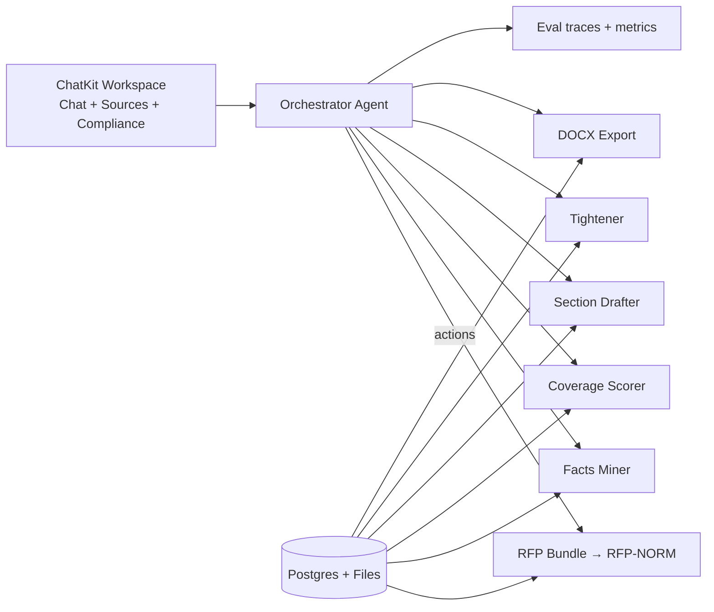

# Granted 2.0 — AgentKit‑Native, RFP‑Agnostic (Rev 3: distilled + upgraded)

> **Product promise:** Paste **any** RFP (URL or PDF), answer a few focused prompts, and get a **traceable, compliant first draft** in minutes—with an ultra‑simple UI and a relentless “Fix‑next” loop to reach submission‑ready.

This revision keeps the strongest ideas from Rev‑2 (AgentKit orchestration, ChatKit UI, RFP‑NORM v1, deterministic coverage, traceable drafting) and **adds missing pieces**: multi‑document RFP handling, a live compliance simulator, conflict resolution, smarter Fix‑next prioritization, and stricter eval gates.

---

## What we kept (and why)

- **Agent‑first orchestration.** A single **Orchestrator** routes to domain tools; **Drafting** and **Compliance** logic stay separated for clarity and smaller prompts. (AgentKit runtime + ChatKit UI).  
- **RFP‑NORM v1.** Canonical schema extracted from any RFP (sections, limits, attachments, eligibility, scoring) powering coverage, drafting, and export.  
- **Deterministic coverage & Fix‑next.** Simple scoring (+0.6 evidenced, +0.3 stub, −0.2 missing required) to decide whether to draft or ask for the highest‑leverage item.  
- **Traceable writing.** Every paragraph links to an RFP requirement path and source evidence; assumptions are explicitly labeled.  
- **One‑screen workspace.** Left rail (Sources), Center (Chat), Right rail (Outline & Coverage).

---

## What’s new in Rev‑3 (the useful upgrades)

### 1) Multi‑document RFP ingestion (addenda, FAQs, attachments)
RFPs often arrive as a main PDF + addenda + FAQs + templates. We now support a **RFP Bundle**: the agent accepts multiple files/URLs and merges them into a single **RFP‑NORM** with **provenance** and **version timestamps**. Conflicts are resolved by “latest‑wins” (explicit date/version) and surfaced as a **Conflict Log** the user can review and override.

**Conflict policy**
1. Prefer explicit `version`/`amendment` numbers; otherwise prefer later `release_date`.  
2. If a later doc narrows a limit (e.g., page count), mark earlier values as superseded and show a yellow banner in the Compliance panel.  
3. Expose a *Resolve* action when two artifacts differ without clear precedence.

### 2) Compliance simulator (formatting‑aware limits)
A panel that approximates **page/word** compliance using the RFP’s declared font, size, spacing, and margins. Users can toggle typical presets (11pt/12pt; single/double) and see section‑by‑section projections. On tighten, we target these projections and warn when text likely overflows.

**Approximation model**
- Words‑per‑page heuristic calibrated by font + size + spacing.  
- Optional “Render sample” using layout estimation (no full WYSIWYG).  
- Tightener accepts `{hard_word_limit, soft_page_limit, font, size, spacing}` and preserves required elements.

### 3) Smarter Fix‑next (impact × effort)
Not all gaps are equal. Each missing item gets a **Value score**: `Δcoverage * reviewer_weight * confidence_gain` and an **Effort score**: `est_time * file_need? * ambiguity?`. The Fix‑next banner prioritizes **highest Value / Effort**, not just coverage delta. This improves guidance and reduces churn.

**Examples**
- “Upload 1–2 team bios (PDF)” → high value/low effort.  
- “Add commercialization traction metrics” → medium value/medium effort.  
- “Draft evaluation plan methodology” → medium value/high effort → suggested after quick wins.

### 4) Eligibility gating
We parse fatal eligibility (“must be a 501(c)(3)”, “under 500 employees”). The agent runs a **short gate** early:
- If unsatisfied, it asks for clarification/edits and keeps drafting **with a banner**: “Eligibility likely not met—confirm before investing more time.”  
- If satisfied, it stores structured eligibility facts for citations in the narrative.

### 5) Observability SLOs (quality & UX)
Ship with hard **SLOs** the agent must respect:
- **TTFD ≤ 5 minutes** for a first draft from RFP + org site + 2–3 sentence idea.  
- **Coverage ≥ 0.70** at first draft (weighted by rubric if present).  
- **Tightener compliance ≥ 98%** (limits met).  
- **Traceability ≥ 95%** of paragraphs have at least one valid source or assumption label.

Failures surface in the **Observability** panel with repro traces; CI blocks merges with degraded scores.

### 6) Error taxonomy & graceful fallbacks
- **E_PARSE_SECTIONS** → open the RFP‑NORM Editor with pre‑filled guesses and guided micro‑tasks.  
- **E_LIMITS_AMBIGUOUS** → ask choice‑based clarifier (chips).  
- **E_OCR_LOWCONF** → request higher‑quality PDF or enable OCR pass; mark low‑confidence artifacts in yellow.

### 7) Slot library (RFP‑agnostic drafting primitives)
A standardized library of **slots** to map any RFP language to common grant concepts:
`problem, beneficiaries, innovation, prior_results, approach, milestones, risks, mitigation, evaluation, impact, commercialization, team, facilities, budget_justification, dissemination`.  
Sections use subsets of these slots; the drafter fills slot text + cites sources, then renders section markdown.

---

## North‑star UX (unchanged, refined)

1) **Welcome** → **Create a grant with AI**  
2) **Intake (ChatKit)** → RFP link/PDF → org site → 2–3 sentence idea  
3) **Agent runs**: parse bundle → facts mining → coverage → **Ready to draft**  
4) **Autodraft** (streamed) → Outline & Coverage tick up live  
5) **Fix‑next** (impact × effort) → in‑chat question or file request  
6) **Tighten & simulate** → page/word projections turn green  
7) **Export DOCX** (+ optional sources appendix)

---

## Architecture sketch (AgentKit + ChatKit)

---

## Canonical contracts (no changes to shapes)
- **RFP‑NORM v1** — canonical extraction with confidence + provenance.  
- **Facts v1** — normalized org/project/team evidence with source pointers.  
- **Coverage v1** — deterministic status per requirement and weighted score.  
- **SectionDraft v1** — slot_fills + markdown; paragraph‑level tags to requirement paths and source quotes.

---

## Acceptance criteria (Rev‑3)
- First‑time user reaches **Autodraft** with **RFP + org site + 2–3 sentence idea**.  
- **Multi‑doc RFPs** merge cleanly; conflicts appear in a **Conflict Log**; user can override.  
- **Compliance simulator** shows green/yellow/red by section; tighten meets limits under simulator settings.  
- **Fix‑next** orders items by Value/Effort; coverage rises monotonically.  
- Exported DOCX opens cleanly with styles and optional sources appendix.

---

## Non‑goals (unchanged)
- Portal auto‑submission; advanced budgeting; reviewer persona simulation.

