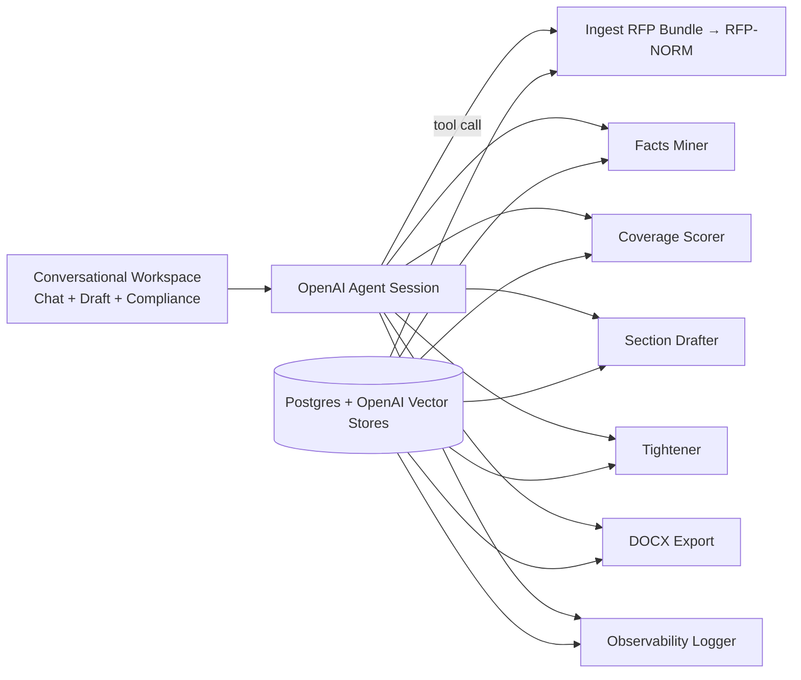

# Granted 2.0 — Agents SDK Native, RFP-Agnostic (Rev 6 · conversational core)

> **Product promise:** Drop in **any** RFP bundle (URLs + PDFs), share a few grounding facts, and the **conversational workspace** streams a traceable, compliant first draft within minutes—driven by one relentless “Fix next” loop until submission ready.

Rev 6 preserves the strongest UX2 patterns (Autodraft-first, deterministic coverage, traceable drafting) while replacing legacy AgentKit/ChatKit plumbing with the **OpenAI Agents SDK** and its native tools (Files, Vector Stores, Sessions, persistent Memory, PDF parsing). The UI is conversation-led: every action—from ingest to tighten—happens in the thread.

---

## What we kept (and why)

- **Agent-first orchestration.** A single Agents SDK orchestrator invokes server-side tools (`ingest_rfp_bundle`, `normalize_rfp`, `draft_section`, `tighten_section`, `export_docx`) while keeping prompts small and roles distinct.  
- **RFP-NORM v1.** Canonical extraction (sections, limits, attachments, eligibility, scoring) continues to anchor coverage, drafting, and exports.  
- **Deterministic coverage + Fix next.** The scoring model (+0.6 evidenced, +0.3 stub, −0.2 missing required) still drives next actions with Value/Effort prioritization.  
- **Traceable writing.** Paragraphs link to requirement paths or assumption labels; provenance chips (`[RFP]`, `[ORG]`, `[BIO:Jane]`) stay visible in the draft pane.  
- **One-screen workspace.** Conversation occupies the center; left rail lists sources, right rail shows coverage + outline. No wizard detours.

---

## What’s new in Rev 6 (Agents SDK upgrades)

### 1) Multi-document RFP ingestion with native File Search
RFPs often arrive as a main document plus addenda/FAQs/templates. Using **OpenAI File Search + Vector Stores**, we ingest bundles into a single **RFP-NORM** with timestamps and provenance. Conflicts surface both in the chat and via a dedicated Conflict Log. Default policy remains “latest wins” (by explicit version/date) with manual override when unclear.

### 2) Conversational workspace front and center
The chat composer is now the primary affordance. Start, Fix next, Tighten, and Export all present as conversational turns with lightweight chips. Agents SDK streaming powers inline status (“Ingesting RFP…”, “Drafting Summary…”) and paragraph deltas. The Draft pane mirrors the conversation, keeping the user anchored in one flow.

### 3) Compliance simulator (formatting-aware limits)
A right-rail simulator approximates word/page compliance using declared formatting (font, size, spacing, margins). Users can toggle presets (11pt/12pt; single/double). Tighten executes via the `tighten_section` tool, honoring those constraints and flagging projected overflow directly in chat.

### 4) Smarter Fix next as chat chips
Value/Effort scoring remains (`Δcoverage * reviewer_weight * confidence_gain` vs `est_time * ambiguity * file_need`). Suggestions surface as single Fix next chips in the conversation. Selecting one injects a tailored prompt or upload request; completion auto-advances to the next suggestion.

### 5) Eligibility gating with session memory
Fatal eligibility checks run early in the session. If unmet, the assistant posts a conversational banner (“Eligibility likely not met—confirm before investing more time”) yet continues upon user confirmation. Eligibility facts persist in session memory so later sections can cite them without re-asking.

### 6) Observability SLOs wired into runs
We ship with hard SLOs and log them per run:
- **TTFD ≤ 5 min** from RFP + org site + idea to first full draft.  
- **Coverage ≥ 0.70** at first draft (rubric-weighted when available).  
- **Tighten compliance ≥ 98 %** vs declared limits.  
- **Traceability ≥ 95 %** of paragraphs with valid sources/assumptions.  
Metrics post to the Observability tab and regressions fail CI smoke tests (3 fixture RFPs).

### 7) Error taxonomy & graceful fallbacks
- **E_PARSE_SECTIONS** → open the RFP-NORM editor with pre-filled guesses plus guided micro-tasks.  
- **E_LIMITS_AMBIGUOUS** → ask a structured clarifier (chips).  
- **E_OCR_LOWCONF** → request higher-quality PDFs or trigger OCR rerun; highlight low-confidence artifacts in yellow.

### 8) Slot library still the drafting backbone
We continue to map RFP language onto standardized slots (`problem, beneficiaries, innovation, prior_results, approach, milestones, risks, mitigation, evaluation, impact, commercialization, team, facilities, budget_justification, dissemination`). Slots assemble into sections; the agent fills them with cited content and renders markdown.

---

## North-star UX (conversation-led)

1. **Attach RFP bundle + org site + idea** directly in chat (file chips).  
2. Agent acknowledges and auto-starts ingest (3 s “Starting draft… Cancel” chip).  
3. **Streaming Autodraft** drops the Summary first, then core sections while coverage + outline animate in the side rail.  
4. **Fix next** chips appear; user taps to address gaps or upload support documents.  
5. **Tighten & simulate** per section—results posted inline with compliance readout.  
6. **Export DOCX** arrives as a final assistant attachment with optional sources appendix.

---

## Architecture sketch (Agents SDK + conversational workspace)

---

## Canonical contracts (unchanged shapes)
- **RFP-NORM v1** — canonical extraction with confidence + provenance.  
- **Facts v1** — normalized org/project/team evidence with source pointers.  
- **Coverage v1** — deterministic requirement status + weighted score.  
- **SectionDraft v1 / FirstDraft v1** — slot fills + markdown; paragraph tags map to requirement paths and source quotes; streamed via Agents SDK events.

---

## Acceptance criteria (Rev 6)
- First-time user sees a streamed Summary ≤ 60 s after providing RFP + org site + idea.  
- Multi-doc RFPs merge cleanly; conflicts surface in chat + Conflict Log with override path.  
- Compliance simulator reflects formatting settings; Tighten keeps sections within limits.  
- Fix next chips raise coverage monotonically and cite supporting evidence.  
- DOCX export opens cleanly with styles and optional sources appendix.

---

## Non-goals (unchanged)
- Portal auto-submission; advanced budgeting; reviewer persona simulation.
